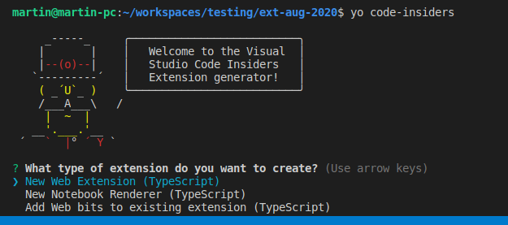

# Yo Code - Extension and Customization Generator

[](https://dev.azure.com/ms/vscode-generator-code-insiders/_build/latest?definitionId=17)

This Yeoman generator helps get with VSCode APIs in development.

## Install the Generator

Install Yeoman and the VS Code Extension generator:

```bash
npm install -g yo generator-code-insiders
```

## Run Yo Code
The Yeoman generator will walk you through the steps required to create your customization or extension prompting for the required information.

To launch the generator simply type:

```bash
yo code-insiders
```



## Generator Output

These templates will
* Create a base folder structure
* Template out a rough `package.json`
* Import any assets required for your extension e.g. tmBundles or the VS Code Library
* For Extensions: Set-up `launch.json` for running your extension and attaching to a process

```

## History


## License

[MIT](LICENSE)
